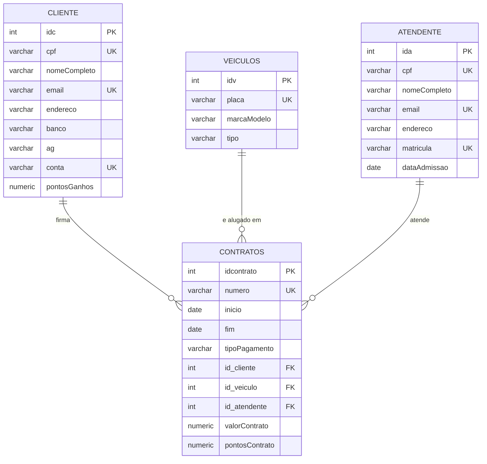

> Sistema de Aluguel de Carros - Motoristas de Aplicativo
> Sobre o projeto

> Tema: Aluguel de carros

Objetivo: Sistema de banco de dados para uma empresa de aluguel de
veículos focada em motoristas de aplicativo (Uber, 99, etc). Gerencia
clientes, atendentes, veículos e contratos de locação.

Público-alvo: Motoristas de aplicativo que precisam alugar carro ou
moto para trabalhar, e atendentes da empresa que fazem a gestão desses
cadastros.

Observação: não coloquei o sistema para trabalhar com caminhões, já
que o foco é em veículos usados por motoristas de app, tipo carros e
motos.

> Modelo de dados

> Scripts

Os scripts estão na pasta scripts/, na ordem que devem ser executados:

1. create_table_cliente.sql
2. create_table_atendente.sql
3. create_table_veiculos.sql
4. create_extension_btree_gist.sql
5. create_table_contratos.sql
6. add_constraint_anti_sobrepor_contratos.sql
7. create_function_atualiza_pontos_cliente.sql
8. create_trigger_atualiza_pontos_cliente.sql
9. insert_into_cliente.sql
10. insert_into_atendente.sql
11. insert_into_veiculos.sql
12. insert_into_contratos.sql

> Autor
Lucas Campigotto - [@lCampigotto] -- LINK DO REPOSITORIO -- [https://github.com/lCampigotto/aluguel-carros-atividade/tree/main]

> Outros integrantes do Grupo: 
Bruno Nunes, Gabriel Santiago, Luiz Dinelly.

Muito obrigado! Se tiver alguma dica de algo que posso melhorar neste projeto me envie por e-mail = campigotto.lucas@proton.me

> Atualizações do Projeto

Sistema de Pontos de Fidelidade Adicionado!

- Coluna pontosGanhos em cliente, guardando o total acumulado de pontos.
- Coluna valorContrato em contratos, com o valor em R$ do aluguel.
- Coluna pontosContrato em contratos, calculada automaticamente pela fórmula valorContrato * 0.5.
- Função e trigger que somam os pontos de cada contrato no total do cliente automaticamente, tanto na criação quanto na edição ou exclusão de um contrato.

Testado inserindo os 7 contratos de exemplo e conferindo que os pontos de cada cliente batem com o valor do contrato correspondente.